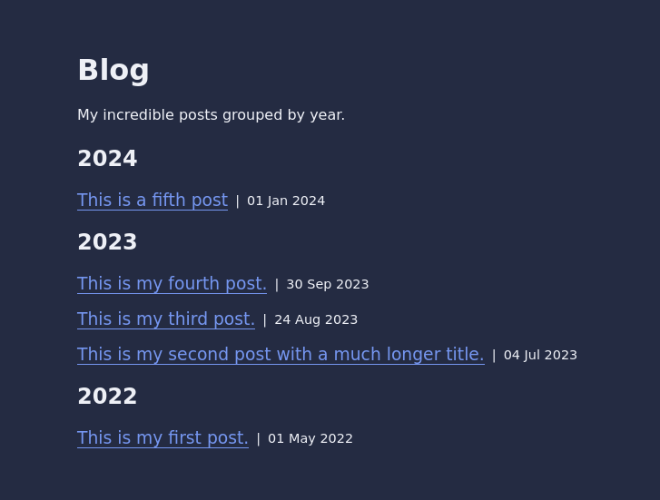
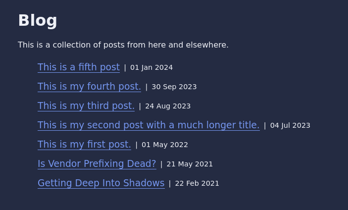
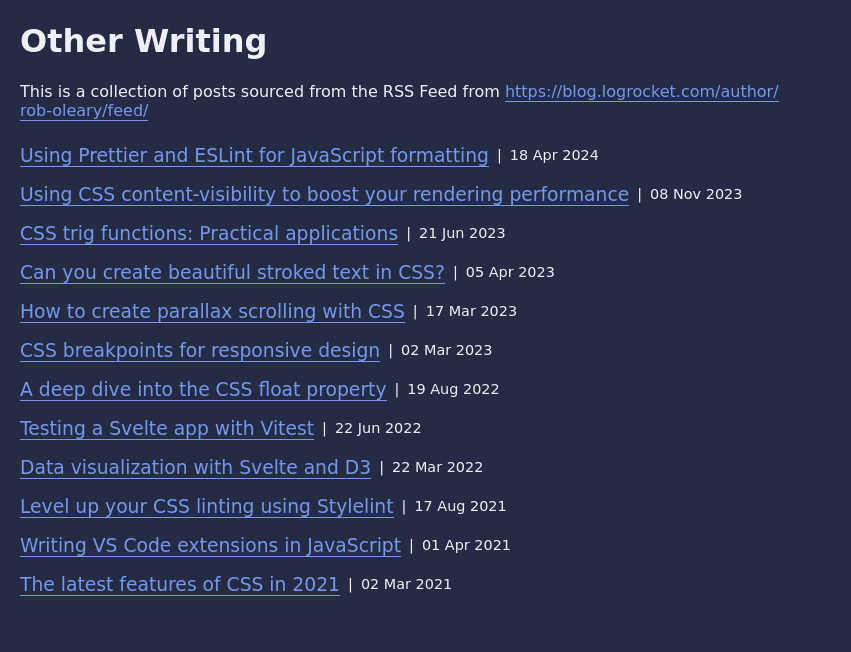
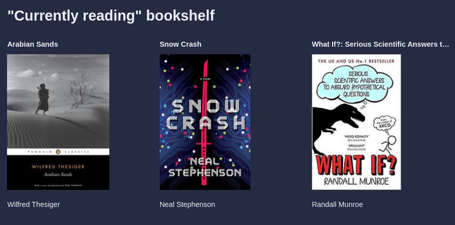
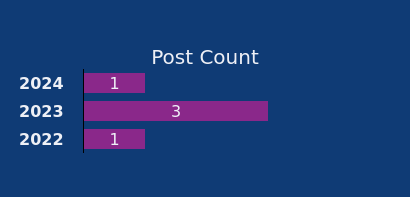

<h1 align="center">
  <br>
    
  <br>
	<br>
  Eleventy tutorials
  <br>
  <br>
</h1>
<h4 align="center">To-the-point tutorials on Eleventy 🎯</h4>
<br>

Tutorials on the [Eleventy](https://www.11ty.dev/) static site generator.

Each tutorial is a self-contained eleventy project.

## Conventions

I use eleventy's default settings most of the time for simplicity. The default project folder looks like this:

```
default-elventy-project/
|- _data/    <- global data files
|
|- _includes/ <- includes and layouts
|
|- _site/ <- the output folder for the generated website
|
|- eleventy.config.js   <- eleventy config file
```

The one exception is that I use nunjucks templating instead of Liquid because it is more popular, and has more a few powerful features.

If I stray from these conventions, I will mention in the tutorial.

## Running tutorials

Open one of the tutorial subfolders. Then, run `npm install` (or equivalent for your favourite package manager) to install the dependencies. Then, you can run the website locally with `npm run dev`.

## Tutorials

<!-- TOC -->
**Tutorial List**
1. [GitHub projects](#github-projects)
1. [Group posts by year](#group-posts-by-year)
1. [Favicon to differentiate between dev and production build modes](#favicon-to-differentiate-between-dev-and-production-build-modes)
1. [Production flag](#production-flag)
1. [Merge custom data with a collection (Make a writing archive)](#merge-custom-data-with-a-collection-make-a-writing-archive)
1. [Convert a RSS Feed into a collection (Make a writing archive)](#convert-a-rss-feed-into-a-collection-make-a-writing-archive)
1. [CSV data file (Make a "currently reading" bookshelf)](#csv-data-file-make-a-currently-reading-bookshelf)
1. [Graph (Post Count)](#graph-post-count)
<!-- /TOC -->

### GitHub projects

A *projects* page that is populated with data fetched from the GitHub API.


We provide a list of repositories that we want to feature in *_data/projects.json* in the following format:

```json
[
  {
    "title": "Eleventy Tutorials",
    "repository": "https://github.com/robole/eleventy-tutorials"
  },
  {
    "title": "Snippets Ranger",
    "repository": "https://github.com/robole/vscode-snippets-ranger"
  }
]
```

We use the GitHub API to provide the additional fields: *description*, *language*, and *star count*.

You can read [this tutorial](https://www.roboleary.net/webdev/2024/02/07/eleventy-fetch.html) for a walkthrough.

The project is in the [github-projects](/github-projects/) folder.

### Group posts by year

It is popular to group posts by year for a blog or archive. I will show you how to do this in ascending or descending order.



The project is in the [group-posts-by-year](/group-posts-by-year/) folder.

### Favicon to differentiate between dev and production build modes

Show a different favicon if the project is run in dev mode or production mode. This gives a clear visual indicator of what version of your website you are seeing in the browser.


You can read [this tutorial](https://www.roboleary.net/2024/02/15/eleventy-favicon-modes.html) for a walkthrough.

The project is in the [favicon-dev](/favicon-dev/) folder.

### Production flag

A production flag is useful for activites that you only want to happen in production such as minifying assets. This project adds a `production` variable that can be used everywhere.

The demo changes the `title` of the homepage if it is run in dev mode or production mode.


You can read [this tutorial](https://www.roboleary.net/webdev/2024/01/24/eleventy-production-flag.html) for a walkthrough.

The project is in the [production-flag](/production-flag/) folder.

### Merge custom data with a collection (Make a writing archive)

Perhaps you post on other websites and would like to reference those external posts on your blog. For example, [I wrote a couple of articles on CSS Tricks](https://css-tricks.com/author/robjoeol/) and would like to include them in my blog for posterity. Rather than make a markdown file for each external post, you could just create a JSON data file and merge it with your `posts` collections.

This is the *_data/externalPosts.json* file:

```json
[
  {
    "url": "https://css-tricks.com/is-vendor-prefixing-dead/",
    "date": "2021-05-21T00:00:00Z",
    "data": {
      "title": "Is Vendor Prefixing Dead?",
      "description": "Browser vendors slowly began to move away from prefixing in 2012. It appeared that the problems created by vendor prefixes would fade away in time. The question is: has that time come yet?",
      "image": "/assets/img/external-posts/2021-05-21-prefixing-dead.webp",
      "publisher": "CSS Tricks",
      "tags": ["CSS"]
    }
  }
]
```

My CSS Tricks posts gets added to my blog list as below.



The project can be found in the [external-posts](/external-posts/) folder.

### Convert a RSS Feed into a collection (Make a writing archive)

Here I demonstrate how to fetch a RSS feed with [eleventy fetch](https://www.11ty.dev/docs/plugins/fetch/), and parse the feed to use as a collection.

In this instance, I am creating a collection from the articles I wrote for LogRocket. LogRocket creates a RSS feed for each author. I list the LogRocket articles on the "Other Writing" page, as per screenshot below.



The project can be found in the [rss-feed-to-collection](/rss-feed-to-collection/) folder.

### CSV data file (Make a "currently reading" bookshelf)

Here I demonstrate how to add the CSV file type as a data file.

In this example, I am displaying my "currently reading" bookshelf. I exported the data as a CSV from the [Calibre e-book library app](https://calibre-ebook.com/) that I use to manage my library.



The project can be found in the [csv](/csv) folder.

### Graph (Post Count)

Here I demonstrate how to make a graph using [chart.css](https://chartscss.org/). It enables styling a HTML table as a graph without the need for JavaScript. This is great for performance and accessibility.



In this example, I create a bar chart of posts grouped by year.

The project can be found in the [graph](/graph/) folder.
