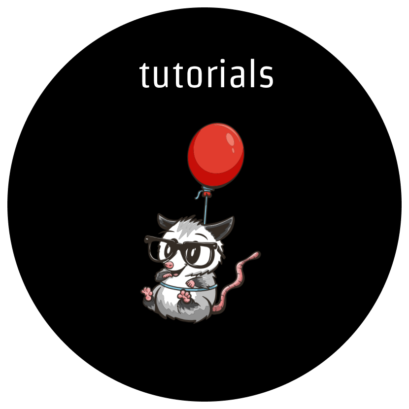
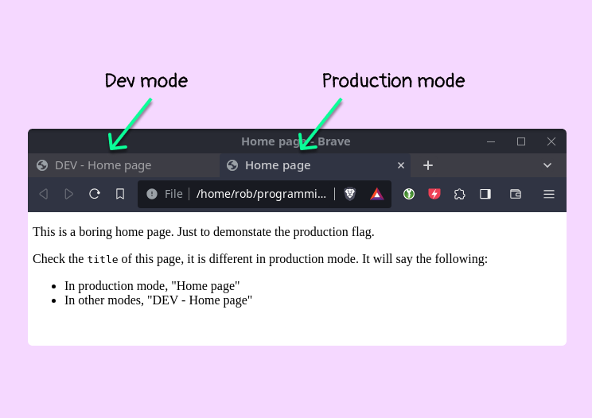
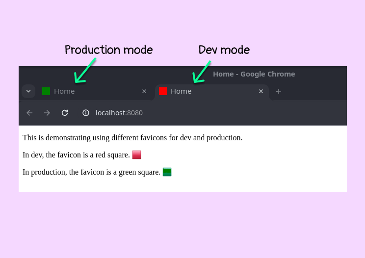

<h1 align="center">
  <br>
    
  <br>
	<br>
  Eleventy tutorials
  <br>
  <br>
</h1>
<h4 align="center">To-the-point tutorials on Eleventy 🎯</h4>
<br>

Tutorials on the [Eleventy](https://www.11ty.dev/) static site generator.

Each tutorial is a self-contained eleventy project.

## Conventions

I use eleventy's default settings most of the time for simplicity. The default project folder looks like this:

```
default-elventy-project/
|- _data/    <- global data files
|
|- _includes/ <- includes and layouts
|
|- _site/ <- the output folder for the generated website
|
|- eleventy.config.js   <- eleventy config file
```

The one exception is that I use nunjucks templating instead of Liquid because it is more popular, and has more a few powerful features.

If I stray from these conventions, I will mention in the tutorial.

## Running tutorials

Open one of the tutorial subfolders. Then, run `npm install` (or equivalent for your favourite package manager) to install the dependencies. Then, you can run the website locally with `npm run dev`.

## Tutorials

### Production flag

A production flag is useful for activites that you want to occur in production such as minifying assets. This project adds an `production` variable that can be used everywhere.

The demo changes the `title` of the homepage if it is run in dev mode or production mode.



You can read [this tutorial](https://www.roboleary.net/webdev/2024/01/24/eleventy-production-flag.html) for a walkthrough.

The project is in the [production-flag](/production-flag/) folder.

### GitHub Projects

We will create a *projects* page that is populated with data fetched from the GitHub API.


We provide a list of repositories we want to feature in the page in *_data/projects.json* in the following format:

```json
[
  {
    "title": "Eleventy Tutorials",
    "repository": "https://github.com/robole/eleventy-tutorials"
  },
  {
    "title": "Snippets Ranger",
    "repository": "https://github.com/robole/vscode-snippets-ranger"
  }
]
```

We use the GitHub API to provide the additional fields: *description*, *language*, and *star count*.

You can read [this tutorial](https://www.roboleary.net/webdev/2024/02/07/eleventy-fetch.html) for a walkthrough.

The project is in the [github-projects](/github-projects/) folder.

### Favicon to differentiate between dev and production build modes

The demo changes the favicon if it is run in dev mode or production mode. This gives a clear visual indicator of what version of your website you are seeing in the browser.



You can read [this tutorial](https://www.roboleary.net/2024/02/15/eleventy-favicon-modes.html) for a walkthrough.

The project is in the [favicon-dev](/favicon-dev/) folder.
